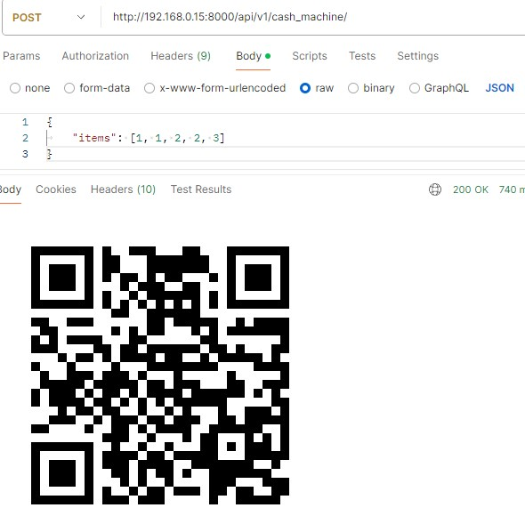
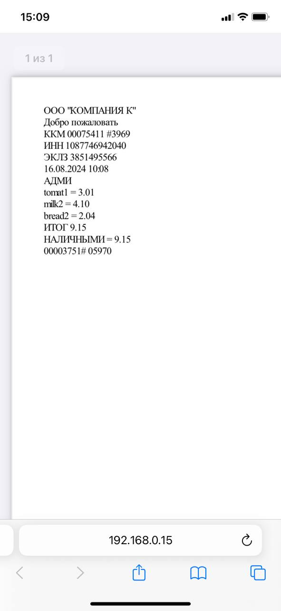

# API Кассового Аппарата Django

Этот проект Django предоставляет конечную точку API для генерации PDF-чеки и QR-кодов для приобретённых товаров. API принимает список идентификаторов товаров, генерирует PDF-чеки и возвращает QR-код, содержащий URL сгенерированного PDF-файла. 

## Небольшой пояснение
(У меня была проблема с qr. Брандмауэр не хотел пропускать запросы с телефона. Пришлось вырубить его и запросы стали проходить. Может быть у вас не будет такой проблемы, но имейте в виду)

## Требования

- Python 3.x
- Django
- Django REST framework
- Библиотека `pdfkit`
- Библиотека `qrcode`
- wkhtmltopdf (необходим для `pdfkit`)

## Установка

1. **Клонируйте репозиторий:**

   ```bash
   git clone <repository-url>
   cd <repository-directory>

2. **Создайте виртуальное окружение и активируйте его:**

    ```bash
    python -m venv venv
    На Windows*: venv\Scripts\activate

3. **Установка зависимостей**

    ```bash
    pip install -r requirements.txt

4. **Установите wkhtmltopdf по инструкции**

5. **Выполните миграции и создайте суперпользователя**

    ```bash
    python manage.py migrate
    python manage.py createsuperuser

6. **Запуск**

    ```bash
    python manage.py runserver


## Конечная точка API

- POST /cash_machine
Описание:

Генерирует PDF-чеки на основе списка идентификаторов товаров, переданных в запросе. Возвращает изображение QR-кода, содержащего URL к сгенерированному PDF-файлу.

Запрос:
- Метод: POST
- Content-Type: application/json

Тело запроса:
________________________________
{
  "items": [1, 2, 3]
}
________________________________

Ответ:
- Content-Type: image/png
- Тело ответа: Изображение QR-кода в формате PNG.

Ответом будет изображение QR-кода, содержащее URL к сгенерированному PDF-чеку.

- 

- 
